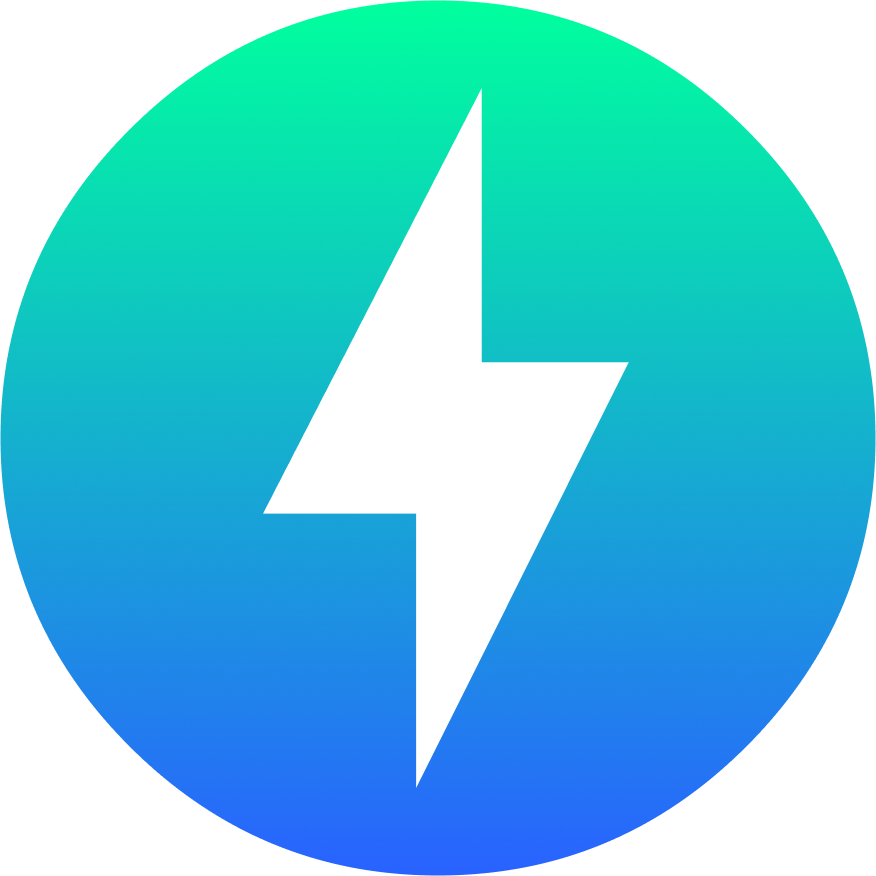

<div align="center">
  
  
  # **Zoltra Templates**
  
  ### *A comprehensive collection of example projects and templates built with the Zoltra framework*
  
  [](https://www.npmjs.com/package/zoltra)
  [](https://typescriptlang.org)
  [](https://nodejs.org)
  
  ---
  
  **🎯 Learn • 🛠️ Build • 🚀 Deploy**
  
  *Kickstart your next project with production-ready examples that showcase the power and simplicity of the Zoltra framework*
  
</div>

<br>

## 🌟 What's Inside

This repository contains a curated collection of example projects demonstrating various features and use cases of the Zoltra framework:

### 📁 **Available Templates**

| Example               | Description                                                                        | Tech Stack                    | Status          |
| --------------------- | ---------------------------------------------------------------------------------- | ----------------------------- | --------------- |
| **🔐 Auth API**       | Complete authentication system with JWT tokens, user management, and secure routes | TypeScript, Zoltra, JWT       | 🔄️ In Progress |
| **🏗️ Basic API**      | Basic starter template with essential configurations and routing setup             | TypeScript, Zoltra            | ✅ Ready        |
| **🔌 WebSocket Chat** | Real-time chat application with WebSocket integration and message broadcasting     | TypeScript, Zoltra, WebSocket | ✅ Ready        |

## 🚀 Quick Start

1. **Create a new project**

   ```bash
   npx zoltra@next create -n <project-name> -t <template-name>
   ```

   Replace `<project-name>` with your desired project name and `<template-name>` with the name of the template you want to use. For example:

   ```bash
   npx zoltra@next create -n auth-app -t auth-api
   ```

   This will create a new directory with the specified project name and copy the selected template into it. Navigate into the project directory:

   ```bash
   cd <project-name>
   ```

2. **That's it!**
   The CLI will install the necessary dependencies and set up the project for you.

   Start the development server:

   ```bash
   npm run dev
   ```

## 📖 Documentation

Each example directory contains its own `README.md` with specific instructions, features, and implementation details. Make sure to check the individual documentation for detailed setup and usage instructions.

## 🤝 Contributing

We welcome contributions! If you have an example project that showcases Zoltra's capabilities:

1. Fork this repository
2. Create a new directory for your example
3. Add comprehensive documentation
4. Submit a pull request

## 🔗 Links

- [Zoltra Framework](https://github.com/zoltrajs/zoltra) - Main framework repository
  <!-- - [Documentation](https://docs.zoltra.dev) - Official documentation -->
  <!-- - [Community](https://discord.gg/zoltra) - Join our Discord community -->

---

<div align="center">

_Ready to build something amazing? Start with one of the examples above! 🚀_

</div>
